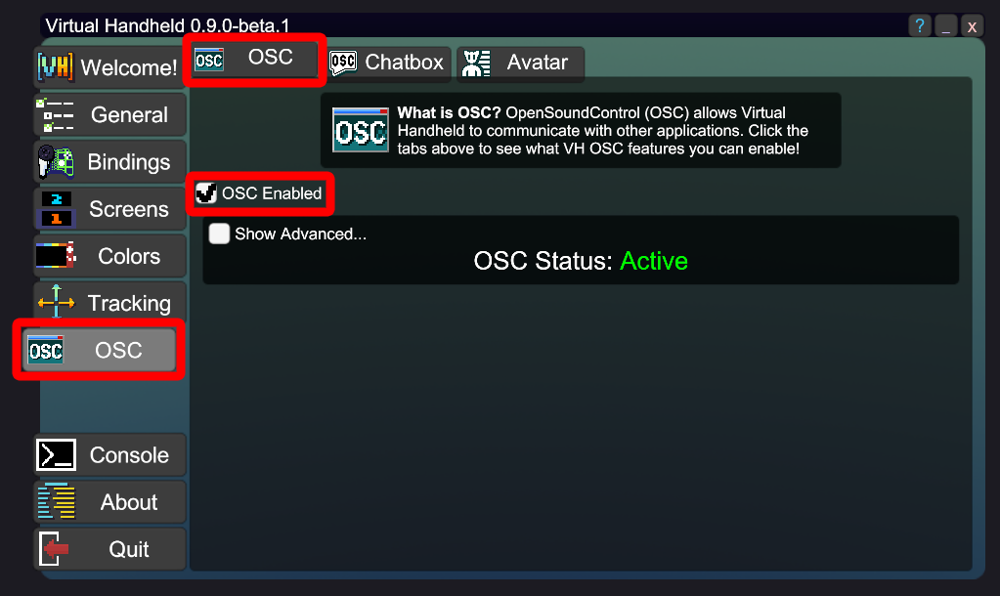
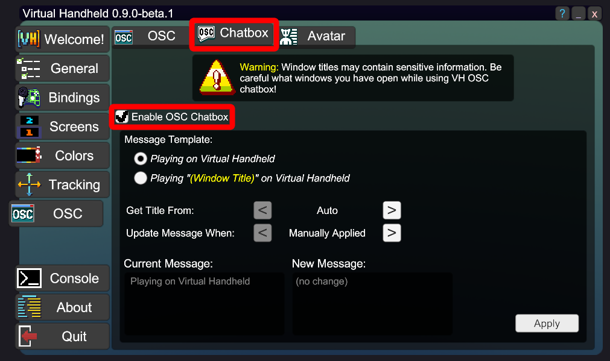
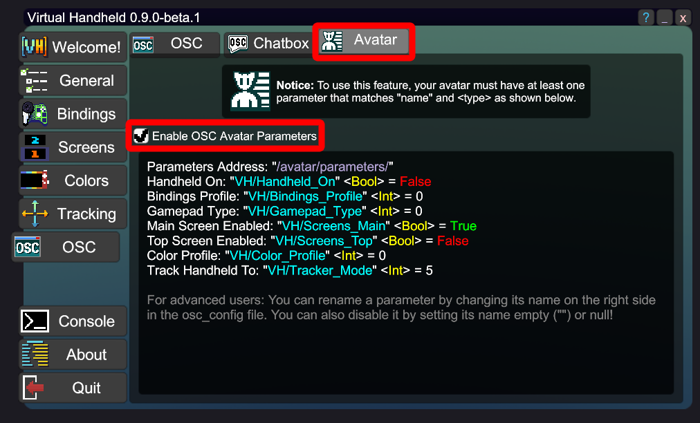

# VH-OSC v1.0 Reference Guide
This an official reference for [Virtual Handheld](https://vhvr.carrd.co/)'s [OSC](https://opensoundcontrol.stanford.edu/) functionality, made for VR avatar creators and asset developers.

# Avatar Parameter List
| Display Name        | Parameter Name      | Type | Range        | Description                                                              |
|---------------------|---------------------|------|--------------|--------------------------------------------------------------------------|
| Handheld On         | VH/Handheld_On      | Bool | True / False | Is the virtual handheld toggled on?                                      |
| Bindings Profile    | VH/Bindings_Profile | Int  | 0 - 255      | The currently selected bindings profile in the Bindings menu             |
| Gamepad Type        | VH/Gamepad_Type     | Int  | 0 - 2        | The currently connected gamepad type; None = 0, Xbox = 1, DualShock = 2  |
| Main Screen Enabled | VH/Screens_Main     | Bool | True / False | Is the main screen of the handheld enabled?                              |
| Top Screen Enabled  | VH/Screens_Top      | Bool | True / False | Is the top screen of the handheld enabled?                               |
| Color Profile       | VH/Color_Profile    | Int  | 0 - 255      | The currently selected color profile in the Colors menu                  |
| Track Handheld To   | VH/Tracker_Mode     | Int  | 1 - 5        | Left Hand = 1, Right Hand = 2, Head Look = 3, Custom = 4, Both Hands = 5 |

# VH Set Up
To use Virtual Handheld's OSC functionality, you must first enable it on the OSC in the Virtual Handheld Settings. (VH Settings can be found in your SteamVR dashboard or on your desktop by double clicking the [VH] system tray icon.)

## Enable OSC Chatbox
If you want a "Playing on Virutal Handheld" chatbox to appear over your avatar in VRChat when you are using the handheld, you must enable it on the Chatbox tab in the VH Settings.

**Other users can see this chatbox. Please be mindful of others when using this feature.**

## Enable OSC Avatar Parameters
If you want VH to send parameters for controlling things such as avatar animations, prop toggles, etc., you must enable them in Avatar tab in the VH Settings.

Note that you must be in an avatar that supports the supplied parameters in order to make use of this feature.

# VRChat Set Up
To use VH-OSC features with VRChat, OSC must be enabled in VRChat as well as VH. You can do this via the Action Menu ("R" key on desktop, long press menu button in VR) and going to *Options > OSC > Enabled*.

For more information on using OSC with VRChat, see [VRChat's OSC documentation](https://docs.vrchat.com/docs/osc-overview).

# Other Application Set Up
OSC is an open standard that any game/app/platform developer can make use of and is not specifically tied to Virtual Handheld or VRChat. If you want to use Virtual Handheld's OSC functionality with other apps that support OSC, please see that app's OSC documentation.

[ChilloutVR OSC documentation](https://docs.chilloutvr.net/chilloutvr/game/osc/)

[Resonite OSC documentation](https://wiki.resonite.com/OSC)

Note that for non-VRChat applications, avatar parameter addresses may be prefixed with `/avatar/parameters/`, so the full paraameter address for "Handheld On" would be `/avatar/parameters/VH/Handheld_On`.

## Avatar Props
All VH avatar props are created and maintained by third parties. Please do not contact the developer of Virtual Handheld for help creating avatars.

However, if you are an asset creator and have made your own handheld prop for VH, please contact the developer via [discord](https://discord.gg/V3hyAxFUwq) to have yours added here!

### Handheld Avatar Prop for Virtual Handheld
Creator: Rycia

Jinxxy: https://jinxxy.com/Rycia/virtualhandheld

Booth: https://booth.pm/en/items/7381922

## Sample Avatars
Here are some avatars you can use to test the VH-OSC functionality in VRChat:

Deira: https://vrchat.com/home/avatar/avtr_5207becf-9350-4c13-8083-37736f5dfc69

DJ Froglin: https://vrchat.com/home/avatar/avtr_0a8d33da-b379-427e-a6c1-443c0e4da503

# Troubleshooting
Note that Virtual Handheld currently only has a basic [OscCore](https://github.com/stella3d/OscCore) implementation and has not yet implemented [OSCQuery](https://github.com/Vidvox/OSCQueryProposal). Due to the limits of this implementation, only one OSC service can be recieving on a port at a time. This means that other programs may conflict with VH-OSC. If you have issues, try disabling other OSC programs or programs that listen on the same port as VRChat (port 9000).

For debugging the VRChat side of OSC, use the built-in [OSC debugger](https://docs.vrchat.com/docs/osc-debugging).

If issues with VH-OSC persist, please make a post in the support forum on [discord](https://discord.gg/V3hyAxFUwq). 
